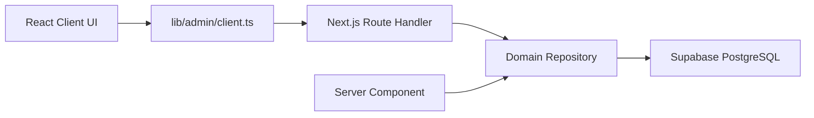
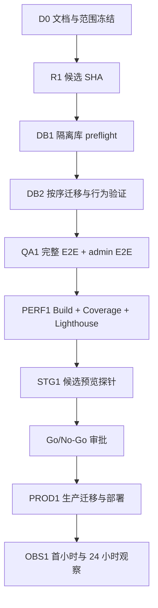

# nav-site 优化与发布主计划（2026-07-18）

> 状态：**Released / Go（主域）** — 2026-07-18 收口  
> 适用范围：2026-07-18 候选从工作树到生产主域的完整证据链  
> 基线：`master` / `9733897d8d417e36cb293e94fff11cde4215ec76`  
> **文内「当前生产 HEAD」为收口当日快照，会过期** — runtime 以 `docs/release-manifest-2026-07-18.md`、主域 `/api/health` `version.commit` 与 `docs/PROGRESS.md` §〇 为准（2026-07-21 探针常见 `ee5a047b`）。  
> 权威单次记录：`docs/release-manifest-2026-07-18.md`  
> 本文保留阶段计划原文，供复盘；**事实状态以 §13 收口结论与 release manifest 为准**。

## 1. 目标

本计划把 2026-07-17 全栈审计、管理后台优化和 2026-07-18 发布审计收束为一条可执行路径：先冻结事实口径和候选版本，再在隔离数据库验证迁移与关键业务路径，最后以同一候选 SHA 完成发布、探针和回滚验证。

本轮优先级不是继续增加功能，而是关闭以下证据缺口：

1. 当前工作树与可追踪候选 SHA 尚未绑定。
2. 新数据库对象、RLS、GRANT、RPC 和触发器尚未在隔离环境验证。
3. 完整 E2E 与 authenticated admin E2E 尚未绑定候选 SHA。
4. Vercel 主发布轨缺少候选 SHA 的自动后验探针证据。

## 2. 证据口径

| 证据类型 | 当前状态 | 使用规则 |
|---|---|---|
| 当前工作树源码与测试 | 已检查，工作树非 clean | 只能描述为“已实现/待提交”，不能描述为“已上线” |
| Git 基线 | `9733897d...` | 只代表最后提交版本，不包含当前未提交优化 |
| 本地质量门禁 | 既有记录显示 lint、typecheck、测试和 webpack build 可通过 | 候选 SHA 形成后必须重新执行，旧结果不能作为发布门禁 |
| 数据库事实 | 不确定 | 未获得 staging/production schema、迁移历史、RLS/GRANT 查询结果前，不声明迁移完成 |
| 生产事实 | 不确定 | 未获得 Vercel deployment commit、主域探针和生产监控前，不外推本地结论 |
| 历史文档 | 存在口径漂移 | 仅作为背景；README、PROGRESS、运行手册中的数量和状态需用新证据校准 |

## 3. 已完成与待完成

### 3.1 当前工作树已实现，待候选级复验

- 分类树防环、最大深度和对应测试。
- 链接与标签的原子事务 RPC SQL 及 repository 接入。
- 敏感接口显式限流故障策略。
- Resource Library 配置入口统一。
- PR CI 移除高权限 Resource Library 凭据。
- ToolQuickView 键盘、ARIA 和稳定 E2E selector 修复。
- 管理后台采用模块化单体 interface：`React UI -> browser adapter -> Route Handler -> repository -> Supabase`。
- 管理后台共享 contract、浏览器 adapter、动态 ID Route wrapper 和边界测试。
- ADR-009 已记录管理后台前后端 interface 分离决策。

### 3.2 发布阻断项

| ID | 阻断项 | 风险 | 退出条件 |
|---|---|---|---|
| R0 | release scope 未冻结 | 高 | 人工核对 diff；候选 SHA 唯一且工作树只保留明确排除项 |
| DB0 | staging 迁移未执行 | 高 | 隔离库按顺序迁移；对象、权限、行为和回滚验证全部留档 |
| QA0 | 完整 E2E/admin E2E 未绑定候选 | 高 | 两套 E2E 退出码 0，报告与 trace 记录候选 SHA |
| CD0 | Vercel 后验探针未绑定候选 | 高 | deployment URL 与主域的 `/build-info.json` 均匹配候选 SHA |
| OBS0 | 生产基线与值守证据不足 | 中高 | 发布前保存基线、阈值、负责人和上一稳定 deployment |

## 4. 目标架构与不可变约束



执行期间保持以下约束：

1. 不拆独立微服务；当前没有独立扩缩容、团队所有权或 SLA 证据支持该成本。
2. Server Component 继续直接调用 repository，不通过自身 HTTP API。
3. 保持现有 API URL、HTTP method、JSON envelope、同源 Cookie、Auth、CSRF 和数据库业务语义。
4. Route Handler 负责 Auth、CSRF、Zod 和 HTTP 错误映射；repository 不接收原始 `Request`。
5. 新增或实质修改的导出函数、hook、业务回调、interface 方法和跨 interface 调用，必须添加说明职责或约束原因的中文注释；不机械注释 React setter、数组方法等库调用。
6. 不引入只做 repository 转发的浅 service 层；出现跨 repository 事务或明确业务编排后再评估。
7. 不读取、记录或提交 secret 值；环境文档只记录变量名和责任边界。

## 5. 依赖顺序



任何上游节点失败时停止推进，不用下游成功掩盖上游缺口。

## 6. 分阶段执行计划

### 阶段 0：文档与 release scope 冻结

**目标：** 让后续参与者只从一套事实入口工作。

实施步骤：

1. 以本文作为当前优化与发布主计划；ADR-009 只保存长期架构决策。
2. 按域审查工作树：管理后台 interface、分类、链接/标签、限流、安全、Resource Library、CI、QuickView、测试、迁移、文档。
3. 标记每个文件为“本候选纳入、后续候选、用户原改动、不确定”，不擅自清理。
4. 为候选准备 release manifest，记录基线 SHA、候选 SHA、文件范围、迁移集合、验证结果和已知限制。

预期收益：验证、部署和回滚都能绑定同一个候选。

潜在风险：错误归类用户原改动；发现边界不清时停止并补证据。

验证方式：`git status --short --branch`、`git diff --stat`、逐域 `git diff -- <paths>`。

完成标准：release scope 经人工确认；候选外文件有明确归属。

### 阶段 1：候选 SHA 与代码质量门禁

**前提：** 获得 commit 授权；push 仍需单独授权。

实施步骤：

1. 按依赖和可回滚性拆分提交，但确保最终候选 SHA 包含完整运行时组合。
2. 对最终候选执行 lint、typecheck、全量测试、coverage、webpack build、依赖审计和 secret scan。
3. 保存命令、退出码、测试数量、artifact 路径和候选 SHA。
4. 检查中文职责注释规则与 admin boundary 静态测试。

预期收益：代码质量证据从“脏工作树的一次结果”升级为“不可变候选结果”。

潜在风险：分拆提交遗漏迁移或测试；release manifest 必须列出代码与数据库兼容矩阵。

验证方式：见第 9 节命令；所有结果必须记录同一 SHA。

完成标准：代码门禁全绿；无未解释的 moderate+ 依赖漏洞；候选 scope 不漂移。

### 阶段 2：隔离 staging 数据库迁移

**前提：** 获得数据库操作确认；明确 disposable staging project ref、备份方式和环境 guard。禁止连接生产执行本阶段。

迁移顺序：

1. 只读核验既有 `migration-audit-s0-constraints.sql` 契约。
2. `scripts/migration-category-hierarchy.sql`
3. `scripts/migration-nav-category-cycle-guard.sql`
4. `scripts/migration-tags.sql`
5. `scripts/migration-admin-link-tags-transaction.sql`
6. `scripts/migration-nav-access-hardening.sql`
7. `scripts/migration-rate-limit-runtime.sql`

每步实施要求：

1. 迁移前记录对象、列、索引、函数、trigger、RLS policy 和 GRANT 状态。
2. 单文件执行，记录开始/结束、目标 project ref 和结果；禁止批量盲跑。
3. 验证公开 anon 读、管理员 service-role 写、非管理员拒绝、事务原子性和并发限流。
4. 验证专用 rollback，但默认保留加法式 schema 和安全收紧。

预期收益：消除 `PGRST204/PGRST205/42883/42501` 等契约漂移，并防止部分写入。

潜在风险：存量分类环、tag slug 冲突、sequence 名不一致、旧权限语义与新 GRANT 冲突。

验证方式：对象查询、RLS/GRANT 查询、分类环拒绝、链接+标签失败回滚、限流并发测试。

完成标准：迁移账本完整；所有行为验收通过；回滚边界明确。

### 阶段 3：候选级功能、E2E 与性能验证

**前提：** 候选应用只连接 disposable staging DB；测试环境 guard 能拒绝生产 project ref。

垂直切片：

| 切片 | 验收路径 | 关键失败条件 |
|---|---|---|
| 分类管理 | 创建父子分类 -> 移动 -> 尝试形成环 | 环写入必须拒绝，合法树保持可读 |
| 链接与标签 | 创建/编辑链接并变更 tags -> 制造 RPC 失败 | link 与 tags 必须同时成功或同时回滚 |
| 管理后台 interface | 列表分页 -> 编辑 -> 删除 -> 错误响应 | UI 不直连 repository；错误 envelope 可见且不误报成功 |
| 敏感写接口 | 登录、提交、收藏、评价、Resource Rating | 限流后端故障时按显式策略执行，不静默 fail-open |
| 首页与 QuickView | 键盘打开/关闭、内部按钮、移动端 | 不劫持内部按钮；焦点和 ARIA 正确 |
| Resource Library | 搜索、评分统计、降级 | 配置来自统一入口，不发生跨项目 split-brain |

实施步骤：

1. 运行普通 E2E 和 authenticated admin E2E。
2. 运行 coverage，重点检查 Auth/CSRF/admin 写/RPC fallback，而不只看全局百分比。
3. 运行 bundle 分析、Lighthouse 和 admin 合成性能；所有数值标记 local/staging/production 口径。
4. 失败时保存 Playwright trace、request id 和数据库错误码；修复后生成新候选 SHA 并从阶段 1 重跑。

完成标准：关键切片与完整套件全绿；无基于定向测试替代全套测试的豁免。

### 阶段 4：staging 探针与 Go/No-Go

**前提：** 获得 preview/staging 部署和配置确认。

实施步骤：

1. 部署精确候选 SHA，确认环境变量只指向 staging 资源。
2. 对 deployment URL 执行 commit-aware probe。
3. 保存 Lighthouse、Sentry 测试事件、API p95 和数据库日志窗口。
4. 由架构、后端/DB、QA、安全、SRE 共同签署 Go/No-Go。

完成标准：deployment commit 与候选一致；P0 阻断为零；所有不确定项有负责人和接受记录。

### 阶段 5：生产发布与回滚演练

**前提：** 生产数据库迁移、Vercel 部署、环境变量变更和生产探针分别获得明确确认。

实施步骤：

1. 记录上一稳定 deployment URL/SHA、数据库备份/PITR 和值守人。
2. 按 staging 已验证的顺序执行生产迁移；每步完成只读验收。
3. 部署精确候选 SHA；先探测 deployment URL，再探测主域。
4. 首小时按 5 分钟粒度观察，24 小时内不叠加无关发布。
5. 出现数据完整性、安全异常、错误率或 p95 越线时恢复上一 deployment；数据库默认保留兼容的加法式对象和安全收紧。

特别禁区：回滚到基线时不能直接 DROP `consume_rate_limit`，因为基线代码同样调用该 RPC。

完成标准：主域 commit 匹配；关键业务成功；回滚路径可执行；观察期无阻断异常。

## 7. 文档责任矩阵

| 文档 | 责任 | 更新时机 | 禁止内容 |
|---|---|---|---|
| 本文 | 当前优化范围、依赖、阶段和门禁 | scope 或阶段改变时 | 未验证生产结论 |
| `docs/adr-009-admin-frontend-backend-interface.md` | 长期架构决策与取舍 | 决策被替代时新增 ADR 并标记 superseded | 临时任务进度 |
| `docs/LAUNCH-CHECKLIST.md` | 发布人员的短检查单 | 发布流程稳定后 | 长篇故障说明 |
| `docs/PRODUCTION-RUNBOOK.md` | 运维步骤、故障处理和回滚 | 平台、环境或迁移契约变化时 | secret 值 |
| `docs/PROGRESS.md` | 已核验里程碑 | 候选或生产事实确认后 | 把工作树状态写成已上线 |
| `CHANGELOG.md` | 用户可感知变化 | 候选冻结后、发布前 | 内部实现噪声和未发布承诺 |
| release manifest | 单次候选 SHA、范围和 artifact 索引 | 每个候选 | 可复用 secret、Cookie、连接串 |
| migration ledger | 目标环境、SQL、结果、验证和回滚 | 每次 staging/production 迁移 | 凭据值 |
| validation report | 命令、退出码、测试数和限制 | 每个候选 | 用历史结果替代当前结果 |
| post-release review | 生产结果、事故和后续动作 | 观察期结束 | 无数据的成功宣称 |

候选形成时建议创建：

```text
docs/releases/<yyyy-mm-dd>-<short-sha>/
  release-manifest.md
  migration-ledger.md
  validation-report.md
  post-release-review.md
```

这些文件在候选 SHA 存在前不提前创建，避免空模板被误认为证据。

## 8. 中长期优化路线图

### 短期（1-2 周）

1. 完成阶段 0-4，重新评估 Go/No-Go。
2. 关闭 staging 数据库迁移、完整 E2E、admin E2E 和 commit-aware probe 证据链。
3. 校准 README、PROGRESS、API 文档和运行手册中的已部署能力、数据规模与平台口径。
4. 为关键 Auth/CSRF/admin/RPC 路径补风险导向覆盖，不以全局覆盖率替代。

### 中期（1-2 月）

1. 首页和 Fuse 索引与全量 links 解耦，以 10 倍数据集验证 payload、内存、INP 和搜索 p95。
2. 统一 OpenAPI/contract 生成入口，减少手写 API 文档漂移。
3. 收紧 CSP `unsafe-inline`，完成 PWA 图标和 SEO 内容类型一致性。
4. 建立生产 RUM、Sentry、数据库 dashboard、业务成功率与发布告警。
5. 明确主导航与 Resource Library 两数据域的产品边界和内容治理责任。

### 长期（3 个月以上）

1. 以 2-6 周生产指标决定搜索服务、缓存和部署边界是否需要演进。
2. 建立 SLO、错误预算、恢复演练和可审计发布 manifest 自动化。
3. 在真实跨域事务、独立 SLA 或团队所有权出现后，再评估 application service 或独立服务。
4. 个性化、Agent API 版本化和商业化实验必须由真实业务指标触发。

## 9. 候选验证命令

以下命令只在相应环境前提满足后运行，并记录退出码和候选 SHA：

```powershell
rtk git status --short --branch
rtk git diff --check
rtk pnpm run lint
rtk pnpm run typecheck
rtk pnpm test
rtk pnpm run test:coverage
rtk pnpm run build
rtk pnpm run audit:security
rtk node scripts/pre-commit-secret-scan.mjs
rtk pnpm run e2e
rtk pnpm run e2e:admin
rtk pnpm run perf:admin
rtk pnpm run verify:launch-readiness -- --skip-network
```

预览或生产探针必须显式传入目标 URL 和候选 SHA，且生产探针只在生产操作单独获批后执行。

## 10. 待补证据

1. staging/production Supabase project ref、schema dump、完整迁移历史、备份/PITR 和恢复演练结果。
2. disposable nav DB 的创建与销毁方式，以及阻止 E2E 指向生产的环境 guard。
3. Vercel Git integration、production branch、deployment protection 和上一稳定 deployment SHA。
4. GitHub required checks、environment protection 和候选 workflow run。
5. 生产 Sentry/RUM/数据库 dashboard、最近基线、阈值和值守人。
6. feature flag 或流量分割能力；若不存在，需要负责人接受无 canary 的剩余风险。

## 11. 授权门

本文授权范围仅为本地文档规划。以下动作必须在执行前分别说明目标、影响、风险、验证和回滚，并获得明确确认：

- commit、push、merge、rebase、tag 或创建发布分支；
- 创建或修改 staging/production 数据库及执行任何迁移；
- 修改 CI、Vercel、Supabase、Cloudflare、GitHub environment 或环境变量；
- 部署 preview/production、启停服务、运行会写数据的 authenticated E2E；
- 生产探针、外部消息、告警或 webhook。

## 12. 完成定义

只有同时满足以下条件，当前优化才可从 Planned/No-Go 变为 Released/Go：

1. release scope、候选 SHA、数据库迁移集合和构建 artifact 一一对应。
2. lint、typecheck、测试、coverage、build、安全审计、完整 E2E 和 admin E2E 绑定同一 SHA。
3. staging 迁移、RLS/GRANT、事务、防环和限流行为均有可复核记录。
4. Vercel deployment URL 与主域都返回正确 commit，并通过关键业务探针。
5. 上一稳定版本、数据库兼容矩阵、值守阈值和回滚路径已确认。
6. README、PROGRESS、API、发布清单、运行手册和 CHANGELOG 不再把未验证能力写成生产事实。

## 13. 收口结论（2026-07-18）

| 门禁 | 结果 |
|---|---|
| 候选 SHA 冻结并 push | ✅ 生产运行时 `ee5a047b`；仓库 `50db5afc` |
| 生产迁库（候选集合） | ✅ supabase-nav-prod |
| 主域部署 + build-info | ✅ `dpl_A9WHnXU…` · commit `ee5a047b` |
| 主域 `verify:production` | ✅ PASS（终检） |
| Preview 功能探针 | ✅ SSO 关 + nav-dev env + embedding ok |
| 前台 UX + T1–T10 | ✅ icon 回填/E2E/LH/OpenAPI 等 |
| Embedding 常开 | ✅ **Cloudflare Workers AI 1024-d**（health 明示）；本机 tunnel 备援 |
| 值守 | ✅ `docs/oncall-and-alerts.md` |

**完成定义对照（§12）：** 主域口径满足 Released/Go；运维增强已落地。  
**权威单次记录：** `docs/release-manifest-2026-07-18.md`。

## 参考文档

- [Release Manifest 2026-07-18](./release-manifest-2026-07-18.md)
- [前台交互与性能优化清单](./frontend-perf-optimization-2026-07-18.md)
- [Preview 环境](./preview-env-setup.md)
- [值守与告警](./oncall-and-alerts.md)
- [Chrome 抽检证据](./perf/chrome-review-2026-07-18/README.md)
- [管理后台前后端 interface ADR](./adr-009-admin-frontend-backend-interface.md)
- [管理后台优化收尾报告](./admin-optimization-closeout-2026-07-17.md)
- [全栈审计](./full-stack-audit-2026-07-17.md)
- [发布检查清单](./LAUNCH-CHECKLIST.md)
- [生产运行手册](./PRODUCTION-RUNBOOK.md)

