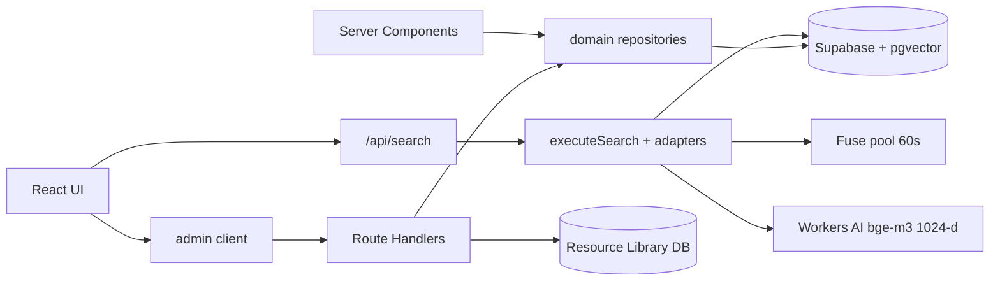

# nav-site 整合研究报告：进度对齐 · 同类经验 · 架构优化 · 验收闭环

> 文档版本：v1.0 · 2026-07-21  
> 项目路径：`D:\nav-site`  
> 生产入口：`https://yuanjia1314.ccwu.cc`  
> 生产运行时 HEAD（实时探针 2026-07-20/21）：**`ee5a047b29e030afc60e75e57b0be913e6b2fd00`** · deploy `dpl_6GCemEkco5zaRGxxzx7Y6bRccorj`  
> 文档权威优先级：`docs/PROGRESS.md` §〇 + `docs/release-manifest-2026-07-18.md` ＞ 历史 Phase / 旧审计 / 根目录会话日志  
> 本文性质：**调研 + 方案对比 + 验收规格**；不执行生产部署、不改密钥、不跑迁移。

---

## 0. 执行摘要（给决策者 3 分钟）

### 0.1 一句话现状

nav-site 已从「功能堆叠期」进入 **「已上线、证据链闭环、以维护成本与规模化为下一主线」** 的阶段：公开导航 + 混合搜索 + Admin 模块化单体 + Cloudflare 1024-d 语义常开 + Vercel 生产单轨均已落地，且主域探针健康。

### 0.2 核心结论

| 维度 | 结论 |
|------|------|
| 产品 | 定位清晰：5 秒找到工具；成功指标是「找到→点击」，不是停留时长 |
| 进度 | 2026-07-18 收口 **Released Go**；运行时 HEAD `ee5a047b`；embedding `cloudflare embedding ready (1024-d)` |
| 架构 | **继续模块化单体** 是最佳主方案；不拆微服务；不引入独立搜索集群（未达阈值） |
| 技术债 | P0 发布阻断项已基本关闭；下一波是 **权限纵深 / 限流 fail-closed / CSP / 搜索规模化触发条件** |
| 同类项目 | 不照搬 OneNav/WebStack 的 PHP/静态形态；可借 **信息架构、运营闭环、书签导入、死链检测**；不借 homelab 仪表盘形态 |
| 下一阶段目标 | 证据驱动的稳定性与规模化准备，而不是新功能冲刺 |

### 0.3 推荐总路线（最佳方案）

**方案 R（Recommended）：「证据驱动的模块化单体深耕」**

1. **冻结产品边界**：公开策展导航 + 投稿审核 + 轻账号（收藏）+ Agent API；不做支付闭环、不做 homelab 仪表盘、不做全站 CMS。  
2. **架构不变式**：Next.js 单部署 + Supabase 单库 + domain repositories + SearchAdapters + Admin contracts/client。  
3. **安全与权限纵深（下一迭代主线）**：公开读 fail-closed、限流分级、favorites/评分权限收敛、CSP 分阶段。  
4. **规模化按触发条件推进**：链接 >2k 或搜索 p95/内存上升再拆 Fuse 全量池；单分类 >800 或 INP 恶化再考虑虚拟列表。  
5. **文档 SSOT 校准**：以 PROGRESS §〇 / release-manifest 为准，清理历史待办与 PROJECT-AUDIT 漂移。  
6. **运营闭环补齐**：死链检测结果进 Admin、icon 持续回填、投稿审核 SLA、金标准搜索回归周期化。

**为什么不是其它方案：**

- 不是「重写成 PHP OneNav 类」：会丢掉现有 Next/语义搜索/Admin interface/测试资产，收益为负。  
- 不是「立刻上 Meilisearch/ES」：当前 ~500 站，进程内 Fuse + pgvector hybrid 足够；引入索引服务增加运维面且无 SLA 证据。  
- 不是「拆前后端双部署」：无独立扩缩容与团队边界（ADR-009 已否决）。  
- 不是「全面停更只运维」：仍有明确 P1 债与运营闭环缺口，停更会放大权限与规模风险。

---

## 1. 调研范围、方法与证据口径

### 1.1 范围

| 纳入 | 不纳入 |
|------|--------|
| 产品定位、完成度、架构、技术债 | 未授权的生产 SQL 执行 |
| 同类开源/商业导航与书签产品经验 | 密钥值、Cookie、连接串 |
| 多方案架构对比与推荐 | 无证据的「已上线」宣称 |
| 目标/约束/边界/IO/验收标准 | 支付商业化完整设计 |
| 细节打磨参考与交互式决策表单 | 把工作树未提交改动写成生产事实 |

### 1.2 方法

1. **进度扫描**：`docs/PROGRESS.md`、`release-manifest`、`PRODUCTION-RUNBOOK`、`LAUNCH-CHECKLIST`、多轮 full-stack-audit、ADR-001~009、admin/frontend perf 收口文档。  
2. **代码交叉验证**：`app/` 路由、`lib/repositories/*`、`lib/search/*`、`lib/admin/*`、`package.json` scripts、env 模板变量名。  
3. **生产探针（本轮）**：主域 `/build-info.json` 与 `/api/health`（2026-07-20/21 会话内实测）。  
4. **同类调研**：WebStack / OneNav / VanNav / Linkwarden / Raindrop / Homarr / Dashy / Heimdall / Flame / Homepage 及中文导航生态合集。  
5. **方案对比**：每类问题给 ≥2 方案 + 取舍矩阵 + 与 nav-site 约束对齐的推荐。

### 1.3 证据等级

| 等级 | 含义 | 示例 |
|------|------|------|
| E0 实时探针 | 本轮 HTTP 实测 | build-info commit、health.embedding |
| E1 发布事实源 | release-manifest / PROGRESS §〇 | Go、512/512 embedding_1024 |
| E2 代码事实 | 仓库当前文件 | route、repository、CSP 头 |
| E3 历史文档 | 旧审计/Phase 后半 | 可能漂移，仅作背景 |
| E4 外部同类 | 公开仓库/评测 | 可借鉴模式，非直接可抄代码 |

**冲突仲裁：** E0 > E1 > E2 > E3；外部同类不覆盖内部约束。

---

## 2. 进度对齐的事实基线

### 2.1 产品定位（不可漂移）

来自 `PRODUCT.md`：

- **用户**：开发者、设计师、AI 从业者、独立开发者；多窗口、多任务；浏览以秒计。  
- **目的**：综合 AI / 开发 / 设计资源导航；500+ 站 × 分类 × 标签交叉 × 语义搜索。  
- **核心任务**：5 秒内找到工具；成功 = 找到 → 点击。  
- **品牌**：友好 · 明亮 · 高效；工具型 UI（Notion/Raycast 气质），不是 Linear marketing、不是 hao123、不是 glassmorphism 套壳、不是 Dock 拟物。  
- **原则**：密度 > 装饰；扫描而非阅读；侧栏→标签→卡片三层骨架；克制配色；键盘可达。

### 2.2 生产事实（E0 + E1）

| 项 | 值 | 等级 |
|----|-----|------|
| 主域 | `https://yuanjia1314.ccwu.cc` | E0 |
| commit | `ee5a047b29e030afc60e75e57b0be913e6b2fd00` | E0 |
| deployId | `dpl_6GCemEkco5zaRGxxzx7Y6bRccorj` | E0 |
| health.status | `healthy` | E0 |
| embedding | `cloudflare embedding ready (1024-d)` · ok | E0 |
| database | ok · 探针 detail 含 categories | E0 |
| distributedRateLimit | **skipped**（Upstash 未配置，in-memory fallback） | E0 |
| 收录规模（文档） | 约 513 站 · 9 主分类 · embedding_1024 512/512 | E1 |
| icon preferred | 512/512 | E1 |
| Lighthouse desktop Perf | 0.97（抽检） | E1 |
| 部署主轨 | Vercel；Netlify 仅 emergency | E1 |

### 2.3 完成度矩阵（对齐 2026-07-21）

| 模块 | 状态 | 证据 |
|------|------|------|
| 首页导航 / 分类 / 键盘 | 已完成 | `app/page.tsx`, `components/Navigation.tsx`, `components/navigation/*` |
| Fuse 服务端搜索 | 已完成 | `lib/search/fuse.ts`, `/api/search` |
| 语义 hybrid（RRF） | 已完成 | CF 1024-d + `search_links_semantic_v2` |
| 工具详情 SEO | 已完成 | `app/tool/[slug]` + static client |
| 点击 / 投稿 / 评价 | 已完成 | 对应 API + repositories |
| 收藏本地 + 登录同步 | 已完成 | `use-favorites` + `/api/favorites` |
| Admin CRUD + interface | 已完成 | ADR-009, `lib/admin/*` |
| Favicon 代理 + 库内 icon | 已完成 | `/api/favicon` + backfill |
| 前台 perf G1–G6 | 已完成 | frontend-perf 文档 |
| Resource Library | 部分 | 路由齐；依赖独立 RL 项目与 env |
| GitHub OAuth | 部分 | 代码条件启用；生产配置需再确认 |
| 标签交叉 / 分类层级 | 部分 | schema/UI 有；运营闭环与数据完整度待核 |
| 支付 | 未做 | `ENABLE_PAYMENTS_API=0` 桩 |
| i18n / PWA 离线 | 未做 | PROGRESS 长期 |
| 虚拟列表 / 独立搜索服务 | 明确阈值触发，当前不做 | backlog T7/T10 |
| 模型排行榜 | 已移除 | Phase 24 |

### 2.4 用户旅程（当前真实路径）

```text
访客
  /  → 侧栏分类 / 标签 / 搜索 / DualTrack(推荐·最新·热门)
  → 卡片外链 + /api/click
  → ToolQuickView / /tool/[slug]
  → /favorites（localStorage；登录后同步）
  → /submit → 审核队列
  → /resources*（独立资源库）
  → /api-docs · /about

管理员
  /login (Credentials + scrypt HASH)
  → /admin · /admin/categories
  → /api/admin/{links,categories,tags}
```

### 2.5 架构快照



**关键不变式（来自 ADR 与 release plan）：**

1. 单 Next 部署，不拆微服务。  
2. RSC 直连 repository，不经自身 HTTP。  
3. Admin：UI → client adapter → Route Handler → repository。  
4. 搜索：薄 route + deep use-case + 可选 adapters。  
5. 生产密码只认 `ADMIN_PASSWORD_HASH`。  
6. 生产 embed 默认 Cloudflare 1024-d；本机 BGE 仅 RL/备援。

### 2.6 文档漂移警示（必须在后续校准）

| 漂移点 | 表现 | 处理 |
|--------|------|------|
| `PROJECT-AUDIT.md` | 早期「API 缺失」等结论过时 | 标注历史，不作为 SSOT |
| `PROGRESS` Phase 后半待办 | 仍写 287 站、标签未做 | 以 §〇 与代码为准修订 |
| `DESIGN-DOC` 部署 | 仍写 Netlify | 改为 Vercel 主轨 |
| `optimization-and-release-plan` 文首 HEAD | 历史候选 SHA 片段 | 以 release-manifest 为准 |
| 根目录 `progress.md` | Superpower 会话日志 | 非产品完成度源 |

---

## 3. 同类项目经验：横向扫描

### 3.1 选型样本（10 类）

| # | 项目 | 类型 | 代表技术 | 参考链接 |
|---|------|------|----------|----------|
| 1 | WebStack | 静态/模板生态导航 | HTML/CSS/JS；大量后端 port | [WebStackPage](https://github.com/WebStackPage/WebStackPage.github.io) |
| 2 | OneNav | 动态书签导航 | PHP + SQLite | [helloxz/onenav](https://github.com/helloxz/onenav) |
| 3 | VanNav | 轻量自托管导航 | Go + React + SQLite | [Mereithhh/van-nav](https://github.com/Mereithhh/van-nav) |
| 4 | Linkwarden | 书签归档管理 | 自托管 + 归档 | [linkwarden.app](https://linkwarden.app/compare/linkwarden-vs-raindrop) |
| 5 | Raindrop.io | 商业书签 | 云 SaaS | raindrop.io |
| 6 | Homarr | Homelab 仪表盘 | Docker 小部件 | [homarr.dev](https://homarr.dev) |
| 7 | Dashy | 可定制仪表盘 | Docker + 主题 | [dashy.to](https://dashy.to) |
| 8 | Heimdall / Flame / Homepage | 应用启动页 | 轻量 tile | self-hosted 社区常见 |
| 9 | awesome-navigation 生态 | 中文导航合集 | 多栈 | [eryajf/awesome-navigation](https://github.com/eryajf/awesome-navigation) |
| 10 | nav-site（本项目） | 策展型开发者资源门户 | Next 16 + Supabase + CF AI | 本仓库 |

### 3.2 逐项优缺点与可借鉴点

#### A. WebStack 系

- **优点**：视觉范式成熟；静态极快；生态 port 多；适合「展示型导航」。  
- **缺点**：原版无后台/无语义搜索/无评价闭环；动态能力依赖 fork。  
- **可直接借**：分类卡片扫描布局、响应式密度、logo 资源组织方式。  
- **需改造后借**：后台与 SEO 详情页——WebStack 没有 nav-site 的程序化 `/tool/[slug]`。  
- **明确不借**：回到纯静态手写 HTML 内容源；会毁掉投稿/审核/语义搜索。

#### B. OneNav

- **优点**：书签导入、死链检测、前台编辑、私有链接、PWA/扩展、Docker 简单。  
- **缺点**：PHP/SQLite 与当前 TS 全栈资产不兼容；偏「个人书签同步」而非「公共策展门户」。  
- **可直接借**：浏览器书签导入、死链批量检测进运营流、右键/备用链接思路。  
- **需改造后借**：AI 检索——nav-site 已有更强的 hybrid + 金标准框架，应强化现有链路而非换栈。  
- **明确不借**：整站迁 PHP；商业化条款与栈锁定。

#### C. VanNav

- **优点**：单二进制/ Docker 友好；搜索优先；键盘快捷；自动抓 metadata。  
- **缺点**：偏个人/小团队服务导航；缺少公开 SEO 内容工厂与社区投稿模型。  
- **可直接借**：搜索优先 IA、快捷键打开结果、自动拉 title/desc/logo。  
- **需改造后借**：PWA 离线——与 PRODUCT「秒级决策」弱相关，优先级低于权限与搜索规模。  
- **明确不借**：SQLite 单文件作为生产主库（已选 Supabase RLS/pgvector）。

#### D. Linkwarden / Raindrop

- **优点**：集合/标签/全文检索/协作；Linkwarden 强调归档抗 link-rot。  
- **缺点**：产品中心是「我的书签库」，不是「公共策展导航」；归档存储成本高。  
- **可直接借**：标签体系与集合心智；link health；（可选）关键页快照策略。  
- **需改造后借**：协作权限模型——nav-site 目前是单管理员 + 公众投稿。  
- **明确不借**：把产品改成私有书签 SaaS（偏离 PRODUCT）。

#### E. Homarr / Dashy / Heimdall / Flame / Homepage

- **优点**：小部件、服务状态、拖拽布局、homelab 一站式入口；Homepage 等对「敏感请求服务端代理」有成熟实践。  
- **缺点**：信息架构是「我的服务墙」，不是「可扫描的公共工具目录」；与 PRODUCT 反引用一致。  
- **可直接借**：状态指示、配置可观测、主题切换工程化、服务端代理敏感请求。  
- **明确不借**：仪表盘 tile 主 UI、重 YAML 运维向配置作为前台主交互、Docker 服务发现作主 IA。

#### F. geek-navigation（极客猿导航）— 最近邻公开导航

- **定位**：独立开发者公开导航站；演进路径「静态 → JSON → Vue/Express/Mongo → Nuxt SSR → 前后台拆分」。  
- **优点**：与 nav-site **产品形态最近邻**；完整展示公共目录必须走向 SSR/SEO + 后台的理由；信息结构产品化。  
- **缺点**：栈为 Vue/Egg/Mongo，代码不可直接复用；社区活跃度需单独评估。  
- **可直接借**：SSR/SEO 作为导航站刚需的叙事；前台目录与后台管理分离的产品边界图。  
- **明确不借**：回退到无 SEO 的 SPA 阶段；Mongo 数据层替换 Supabase。

#### G. linkding — 极简书签工程纪律

- **定位**：自托管极简书签；Django；Netscape 导入导出；OIDC/代理认证；REST。  
- **优点**：模型克制、可维护；导入导出标准；认证集成干净。  
- **可直接借**：**Netscape/HTML 书签导入** 与 `bulk:add` 并列；OIDC/代理认证思路（映射到 Auth.js provider，而非换 Django）。  
- **明确不借**：把公共导航改成个人书签柜 UI。

#### H. Karakeep（原 Hoarder）/ Linkwarden 的 AI 运营面

- **定位**：囤积 + 归档 + LLM 打标/摘要（Karakeep）；协作书签 + 全文归档（Linkwarden）。  
- **优点**：AI 辅助整理与防 link-rot 的产品闭环清晰；Next/TS 亲和。  
- **缺点**：AGPL 传染风险；资源与版权成本高；主任务是个人知识库。  
- **需改造后借**：LLM 自动标签/摘要 **只挂 Admin/ingest/投稿审核**，人工确认后入库；RSS/规则自动收录扩展现有 `resource:ingest` 且强制 source allowlist。  
- **明确不借**：默认全站 HTML/PDF 归档；AGPL 整仓底座；把导航站做成囤积器。

#### I. Raindrop.io — 商业 UX 上限参考

- **定位**：跨端云书签；集合/标签/扩展/多视图；Pro 含全文与 AI。  
- **可直接借**：扩展捕获体验、公开集合分享心智、保存时的结构化整理建议。  
- **明确不借**：闭源云依赖作为主数据面；用「云同步书签」替代策展质量与语义命中率作为增长叙事。

### 3.2.1 四族定位对照（战略一眼表）

| 族 | 代表 | 用户任务 | 与 nav-site 关系 |
|----|------|----------|-----------------|
| 公共分类目录 | WebStack、geek-nav、**nav-site** | 在公开互联网找工具 | **本族** |
| 个人书签树 | OneNav、linkding、Raindrop | 同步我的链接 | 可借运营零件 |
| 服务 Launcher | Homepage/Dashy/Homarr/Flame | 打开我的服务 | 明确不借主 IA |
| 知识囤积+归档 | Linkwarden、Karakeep | 保存并回读内容 | 可选侧能力 |

**战略短句：** nav-site 最近邻是 geek-navigation / WebStack 类公开目录，不是 Dashy 类 startpage；差异化组合（Fuse+向量、投稿审核、资源 ingest、Agent API、程序化 SEO）多数同类没有完整拼齐——应加深而非换族。

### 3.3 横向模式提炼

| 模式 | 同类常见做法 | nav-site 现状 | 建议 |
|------|--------------|---------------|------|
| 信息架构 | 分类树 + 卡片；或搜索优先 startpage | 侧栏分类 + 标签 + 搜索 + DualTrack | 保持三层骨架；强化「搜索解释/空状态」 |
| 内容模型 | 链接/分类/标签；书签常无公开 slug SEO | 有 slug、详情页、JSON-LD、sitemap | **差异化优势，继续加深** |
| 搜索 | 前端过滤 / 简单后端 / 少量 AI | Fuse + pgvector RRF + CF embedding | 保持 hybrid；按阈值再 FTS/专用索引 |
| 权限 | 单管理员 或 多用户私有 | Admin Credentials + 可选 GitHub user | 先做权限纵深，再扩多管理员 |
| 运营 | 导入/死链/拖拽排序 | bulk-add、check:links、Admin CRUD | 把检测结果产品化到 Admin |
| 部署 | Docker/PHP/静态 | Vercel + Supabase + CF AI | 保持；避免再引入第二生产轨 |
| 扩展 | 浏览器扩展/PWA | 无扩展；有 manifest | 扩展可作为中期「提交/收藏」加速器，非 P0 |

### 3.4 对照清单：直接借 / 改造后借 / 不借

| 动作 | 项 |
|------|----|
| **直接借** | 死链检测运营化；Netscape/JSON 导入与 `bulk:add` 并列；搜索优先空状态与快捷键；link metadata 自动抓取强化；标签心智文案；公开 API 缓存头与 Agent 友好；投稿/审核分离纪律；纸面搜索工作台视觉纪律 |
| **改造后借** | 集合/文件夹（映射为分类层级+标签，不引入第二套书签模型）；归档快照（仅对高价值死链）；浏览器扩展（只打 submit/favorite API）；LLM 打标挂审核流；RSS/规则 ingest + allowlist；备用 secondary_url；OIDC/社交登录扩 Auth.js；Admin 拖拽排序字段 |
| **明确不借** | PHP/SQLite 换栈；homelab 仪表盘 UI；全站私有书签化；无证据拆微服务；未达阈值上 ES/Meili；恢复 Netlify 主轨；AGPL 整仓依赖；默认全量网页归档；弱口令 demo 文化；小部件堆首页；Mongo/Express 重写；复制第三方文案资产 |

### 3.5 从同类失败与成功里抽出的「十条工程军规」

1. **公共导航的 SEO 不是加分项，是物种特征**（geek-nav 演进史）。  
2. **个人书签的同步爽感，不能替代策展密度**（Raindrop 再强也不是公开目录）。  
3. **死链不进运营队列，检测脚本就只是日志**（OneNav 的产品化 vs 仅 CI artifact）。  
4. **AI 标注必须有人确认，否则分类体系会被噪声污染**（Karakeep 能力 × 公共站约束）。  
5. **键盘流是效率用户的护城河，但要服务扫描，不服务炫技**（VanNav）。  
6. **Launcher 小部件会蚕食首页注意力预算**（Homarr/Dashy 教训）。  
7. **静态 YAML 真相源撑不住投稿与向量**（WebStack 边界）。  
8. **Serverless 前台 + 托管 DB + 独立 embed 是公开语义导航的合理拆法**（与 ADR-008/路径 B 一致）。  
9. **扩展只应持有用户会话能力，绝不持有 service_role**。  
10. **许可（AGPL）与功能吸引力要分开评估**，底座选型先看传染面。

---

## 4. 架构优化：问题集与多方案对比

下列每个问题都给出 ≥2 方案，并用「与项目要求契合度」打分（1–5）。

### 4.1 总体架构形态

| 方案 | 描述 | 契合度 | 成本 | 风险 |
|------|------|--------|------|------|
| **R1 模块化单体（现状加深）** | 单 Next 部署；domain repo；Admin contracts；SearchAdapters | **5** | 低 | 低 |
| R2 BFF + 独立 API 服务 | 前后端分仓分部署 | 2 | 高 | 中高：CORS/鉴权/双发布 |
| R3 微服务（搜索/embed/admin 拆分） | 多服务多 SLA | 1 | 很高 | 高：无团队/流量证据 |

**推荐 R1。** 理由：ADR-009 与 release plan 已明确「无独立扩缩容/所有权证据」；当前质量门与探针都建立在单体上。R2/R3 在 ~500 站、单管理员场景属于过早分布式。

### 4.2 搜索架构

| 方案 | 描述 | 契合度 | 触发条件 |
|------|------|--------|----------|
| **S1 维持 Fuse 池 + CF 语义 + RRF（现状）** | 60s 缓存全量池；hybrid | **5（当前规模）** | 默认 |
| S2 Postgres FTS/RPC 候选 + 小集合 Fuse | 先 RPC 预过滤再模糊 | 4 | 链接 >2k 或 p95/内存上升 |
| S3 引入 Meilisearch/Typesense | 独立索引服务 | 2 | >10k 或复杂多语言相关性需求 |
| S4 纯语义、去掉 Fuse | 只靠向量 | 2 | 会伤短词/品牌精确匹配 |

**推荐：当前 S1；规模化预研 S2；明确不选 S3/S4 作为近期。**  
同类教训：OneNav/VanNav 的「AI 搜索」多为体验点缀；nav-site 已有金标准与 RRF，应保护排序稳定性，避免换引擎导致回归。

### 4.3 Embedding 主路径

| 方案 | 描述 | 契合度 | 备注 |
|------|------|--------|------|
| **E1 Cloudflare Workers AI 1024-d（现状）** | 24×7，不依赖本机 | **5** | 已上线，探针 ok |
| E2 本机 BGE + Tunnel | 历史路径 A | 2 作为主导航 | 仅 RL/备援 |
| E3 Fly/VPS 自托管 BGE | 常开 GPU/CPU 服务 | 2 | 用户无账单/VPS 硬约束 |
| E4 浏览器端模型 | transformers.js | 1 | 体积/一致性差 |

**推荐 E1 保持。** 文档与代码已对齐；回滚路径写在 release-manifest。

### 4.4 数据访问与 Admin

| 方案 | 描述 | 契合度 |
|------|------|--------|
| **D1 域 repositories + Admin contracts（现状）** | ADR-003/006/009 | **5** |
| D2 引入 ORM（Prisma 等） | 统一 schema | 2 | 增加迁移与 Supabase 分叉 |
| D3 再加一层无业务的 service | 纯转发 | 1 | ADR-009 已否决（deletion test 失败） |
| D4 Admin 独立 SPA 仓库 | 分前端仓 | 2 | 无团队边界 |

**推荐 D1。** 下一步是「权限 locality」与显式列投影，而不是新分层。

### 4.5 权限与安全纵深

| 问题 | 方案 A | 方案 B | 推荐 |
|------|--------|--------|------|
| 限流多实例 | 维持 memory fail-open | 敏感路由 fail-closed + Upstash 配置 | **B（分级）** |
| favorites | 维持 service_role + app 过滤 | 安全 RPC/JWT subject 强制 user_id | **短 A 加固校验，中 B** |
| CSP | 立刻删 unsafe-inline | report-only → nonce 分阶段 | **B** |
| 公开评分读 | service_role 回退 | 仅公开 RPC，失败 503 | **B（代码已偏向）** |
| CSRF 无 Origin | 维持放行 | cookie 写操作强制 Origin/token | **B 对写路径** |

### 4.6 前端性能与 IA

| 问题 | 方案 | 推荐 |
|------|------|------|
| 首屏全量 links | 继续全量 / 首屏摘要+API | 当前全量可接受；>1k 切摘要 |
| 列表 | 渐进挂载 / 虚拟列表 | 渐进挂载；T7 阈值后再虚拟 |
| 分类切换 | remount vs 状态重置 | 已选去 remount（frontend-perf） |
| 图标 | 代理 vs 库内 preferred | 库内优先 + 代理兜底（已做） |

### 4.7 部署与多轨

| 方案 | 契合度 | 说明 |
|------|--------|------|
| **Vercel 单轨 + Netlify emergency** | **5** | 当前 runbook |
| 恢复 Netlify 双主轨 | 1 | 额度与复杂度已否决 |
| 迁 Cloudflare Pages 全站 | 2 | 无充分迁移收益证据 |

### 4.8 综合推荐架构（目标态 1–2 个迭代）

```text
[Browser]
  公开 UI（纸面工作台）
  Admin UI（工作台语义令牌）
        │
        ▼
[Next.js 16 模块化单体 · Vercel]
  RSC ──► repositories/* ──► Supabase (RLS)
  Route Handlers
    ├─ public: search/tools/click/submit/reviews/favicon/...
    ├─ auth: next-auth
    └─ admin: with-admin → repositories
  search/use-case
    ├─ Fuse pool (直至触发 S2)
    └─ CF Workers AI 1024-d → pgvector RPC
  rate-limit: Upstash 优先；敏感写 fail-closed
  observability: health + build-info + Sentry + web-vitals

[可选]
  Resource Library 独立库（公开 RPC）
  本机 BGE 512-d 仅 RL/备援
```

**最佳方案之所以最佳：** 它最大化复用已验证资产（测试、探针、ADR、发布证据链），把增量风险压在「权限与规模触发条件」上，而不是重开技术栈赌博；与 PRODUCT 的 5 秒决策、与运维「单管理员/Hobby 预算/无 VPS」约束完全同向。

---

## 5. 技术债组合（按优先级与触发）

### 5.1 P0（若复发则阻断发布）

| ID | 项 | 当前 | 退出条件 |
|----|-----|------|----------|
| P0-1 | 详情页静态/cookies 回归 | 已修 | `/tool/*` 200 + 无 dynamic cookie 日志 |
| P0-2 | 生产 build-info / health 假绿 | 需持续探针 | `verify:production --expect-commit` PASS |
| P0-3 | 公开高权限读回退 | 评分 GET 已收 | 无 service_role 公开读路径 |

### 5.2 P1（下一迭代主线）

| ID | 项 | 建议动作 | 验收 |
|----|-----|----------|------|
| P1-1 | 限流 fail-open | 配置 Upstash；敏感路由 fail-closed | health 显示 backend；故障时 429/503 |
| P1-2 | favorites 权限纵深 | UUID 全校验 + IDOR 测试；规划 RPC | 双用户矩阵测试 |
| P1-3 | CSP | report-only → nonce | 无未知违规；页面/Sentry 正常 |
| P1-4 | API 契约漂移 | OpenAPI 与 route/schema 同源；CI diff | curl 样例可跑通 |
| P1-5 | 文档 SSOT 漂移 | 修订 PROGRESS 后半 / DESIGN-DOC 部署 | 无 287 站等旧口径 |
| P1-6 | 搜索规模预备 | 设计 S2 方案与压测脚本 | 有阈值仪表，不提前上服务 |

### 5.3 P2（打磨与效率）

| ID | 项 | 建议 |
|----|-----|------|
| P2-1 | Repository 显式投影 | 去掉不必要 `select("*")` |
| P2-2 | 键盘焦点 vs 挂载预算 | 共用控制器 |
| P2-3 | 覆盖率阈值分阶段上调 | 先补风险路径再抬门禁 |
| P2-4 | Admin 分类 API p95 | 缓存/投影 |
| P2-5 | OAuth 生产配置确认 | 文档化 on/off |
| P2-6 | 死链检测产品化 | 报告 → Admin 队列 |

### 5.4 明确延后（有触发条件）

| ID | 项 | 触发 |
|----|-----|------|
| T7 | 虚拟列表 | 单分类 >800 或 INP p75 >200ms |
| T9 | 硬删 unsafe-inline | nonce 流水线就绪 |
| T10 | Fuse 全量池拆分 | 链接 >2k 或搜索 p95/内存上升 |
| L-i18n | 国际化 | 出现明确多语言用户证据 |
| L-pay | 支付 | 商业模式确认 |
| L-pwa | 离线 PWA | 用户在弱网场景强需求 |

---

## 6. 目标 · 约束 · 边界

### 6.1 目标分层

#### G0 北极星

**让目标用户在 5 秒内找到并点击正确工具**（`PRODUCT.md`）。

#### G1 产品目标（90 天）

1. 公开导航体验不回退（滚动、图标、搜索、键盘）。  
2. 语义搜索 24×7 可用（CF 路径健康可观测）。  
3. 投稿 → 审核 → 上线闭环可在 Admin 内完成。  
4. Agent/第三方可通过稳定 API 取数。  

#### G2 工程目标（90 天）

1. 权限与限流达到「故障时可预测」。  
2. 文档 SSOT 无关键矛盾。  
3. 发布始终绑定 commit 探针。  
4. 搜索/列表规模化有触发仪表，无过早重构。  

#### G3 非目标（明确不做）

1. 不做 homelab 仪表盘化。  
2. 不做支付闭环（除非另立项）。  
3. 不做微服务拆分。  
4. 不做 Fly/VPS 必选 embedding 主路径。  
5. 不做以停留时长/广告密度为导向的改版。

### 6.2 约束

| 类型 | 约束 |
|------|------|
| 组织 | 单管理员/个人项目维护带宽 |
| 预算 | Vercel Hobby + Supabase + CF Workers AI；无 Fly 账单 |
| 技术 | Next 16 + webpack 必选（NTFS reparse）；React 19；Supabase |
| 安全 | 不提交密钥；生产禁用明文 ADMIN_PASSWORD |
| 发布 | Vercel 主轨；主域探针为权威 |
| 兼容 | 公开 API URL/method/envelope 稳定 |
| 体验 | 键盘可达；WCAG AA 对比度底线；reduced-motion |
| 文档 | 中文职责注释；证据先于结论 |

### 6.3 边界

| 边界 | 内 | 外 |
|------|----|----|
| 数据 | nav 主库链接/分类/标签/评价/收藏 | RL 库（独立项目，契约调用） |
| 身份 | Admin Credentials；可选 GitHub user | 完整企业 IdP/多租户 |
| 搜索 | 站内工具检索 | 全网爬虫搜索引擎 |
| 内容 | 人工策展 + 投稿审核 | UGC 社区帖文/Feed |
| 客户端 | Web 响应式 | 原生 App |
| 部署 | Vercel 生产 | 第二常开应用轨 |

---

## 7. 输入 · 输出 · 验收标准

### 7.1 系统输入

| 输入 | 来源 | 校验 |
|------|------|------|
| 环境变量 | Vercel / `.env.local` | readiness：必要项存在（不打印值） |
| 导航主数据 | Supabase `nav_*` | RLS + service_role 分层 |
| 用户投稿 | `/api/submit` | Zod + 限流 + 审核态 |
| 搜索查询 | `/api/search` | 长度/limit/semantic 开关 |
| 管理员操作 | `/api/admin/*` | Auth + CSRF + Zod |
| Embedding | CF Workers AI / 备援 BGE | 维度与 RPC 版本一致 |
| 资源库 | RL 公开 RPC/配置 | 失败可降级，不 split-brain |
| 可观测 | Sentry / web-vitals / 探针 | 采样与告警阈值 |

### 7.2 系统输出

| 输出 | 消费者 | 形态 |
|------|--------|------|
| 首页/分类浏览 | 访客 | HTML/RSC + 客户端筛选 |
| 搜索结果 | 访客/Agent | JSON results + facets |
| 工具详情 | 访客/SEO | HTML + JSON-LD |
| Agent 工具列表 | 第三方 | `/api/tools` JSON |
| 健康/构建信息 | 运维 | `/api/health`, `/build-info.json` |
| Admin 工作台 | 管理员 | 分页 CRUD UI |
| 文档 | 开发者 | README/API/Runbook/ADR |

### 7.3 验收标准（可执行）

#### A. 发布验收（每次上线）

```powershell
pnpm run lint
pnpm run typecheck
pnpm test
pnpm run build
pnpm run audit:security
pnpm run verify:production -- --base-url https://yuanjia1314.ccwu.cc --expect-commit <HEAD>
```

必须：

1. 主域 `/` 200  
2. `/build-info.json.commit == HEAD`  
3. `/api/health`：database/env ok；embedding 与配置一致（生产期望 cloudflare 1024-d ok）  
4. `/api/search?q=ai&limit=5` 返回 JSON  
5. `/tool/figma` 200  
6. `/sitemap.xml`、`/robots.txt` 可访问  

#### B. 语义搜索验收

1. `embedding` health detail 含 `1024-d`（生产默认）  
2. `semantic=true` 返回 hybrid，且高相关词含 similarity  
3. 短查询 <3 走 Fuse，不产生劣质语义噪声  
4. CF 故障时降级行为可解释（非静默假成功）

#### C. Admin 验收

1. 未登录访问 `/admin` 拒绝  
2. 非 admin role 拒绝  
3. 链接/分类/标签 CRUD 成功路径与错误 envelope 可见  
4. 分类环写入拒绝  
5. UI 不直连 `lib/repositories`（boundary 测试）

#### D. 安全验收

1. 生产拒绝明文 `ADMIN_PASSWORD`  
2. 公开 GET 不走 service_role 明细读  
3. 限流：Upstash 配置后跨实例有效；敏感写故障策略显式  
4. 无密钥进入 git  
5. CSP 变更不破坏 hydration/Sentry

#### E. 性能验收（回归预算）

| 指标 | 预算 | 口径 |
|------|------|------|
| Lighthouse Perf（desktop 抽检） | ≥ 0.90 | 生产或等价 |
| 侧栏切换 scrollY | 结果区可见时 ≈0 | E2E/手工 |
| 首屏卡片预算 | ~24–32 可见级 | 代码常量 |
| 搜索 p95 | 记录基线；异常告警 | 日志/RUM |
| Admin 首包 | 不回退已减体积 | bundle 分析 |

#### F. 文档验收

1. PROGRESS §〇 与 release-manifest 一致  
2. 无「Netlify 生产主轨」「287 站」等过时口径残留于权威段落  
3. API 示例域名与字段与代码一致  

---

## 8. 细节打磨参考（可执行清单）

### 8.1 UX / 视觉

| 项 | 参考 | 做法 |
|----|------|------|
| 纸面工作台 | Phase 25/26、PRODUCT | 保持低饱和；禁玻璃拟态 |
| 空状态 | OneNav/VanNav 搜索优先 | 无结果时给「改分类/清标签/投稿」 |
| 图标 | frontend-perf | preferred icon 优先；Globe 闪烁最小化 |
| 滚动 | G1 | 分类切换不强制回顶 |
| 动效 | PRODUCT | reduced-motion；禁装饰性 motion |
| 键盘 | PRODUCT + 审计 F-05 | 焦点与挂载预算同步 |

### 8.2 搜索体验

| 项 | 做法 |
|----|------|
| 防抖 | 保持 200ms |
| 语义开关 | UI 状态可读；失败可感知 |
| 金标准 | 周期性 `test:quality` |
| 解释性 | 可选展示 source=fuse/semantic（勿噪音化） |
| 短查询 | <3 禁用语义 |

### 8.3 运营打磨

| 项 | 同类启发 | 落地 |
|----|----------|------|
| 死链 | OneNav/Linkwarden | `check:links` 报告进 Admin「待处理」 |
| 导入 | OneNav 书签 HTML | 扩展 bulk-add UX |
| 元数据 | VanNav 自动抓取 | 提交时预填 title/desc/icon |
| 排序 | 拖拽 | 非必须；featured + click_count 已够 |

### 8.4 可观测

| 信号 | 阈值参考 | 动作 |
|------|----------|------|
| health.embedding | 生产 ok | 失败告警 |
| 5xx 率 | 按 oncall 文档 | 回滚 deployment |
| LCP/INP | ops-observability-baseline | 查列表/搜索回归 |
| rate-limit backend | 期望 upstash 或显式 skipped | 勿静默 |

### 8.5 安全打磨

| 项 | 最小下一步 |
|----|------------|
| Upstash | 配 REST，敏感写 fail-closed |
| favorites | 全 ID Zod + IDOR 测试 |
| CSP | Report-Only 收集 |
| API docs | 域名/限流/字段对齐 |
| secret scan | 维持 pre-commit 可选 hook |

---

## 9. 整合前序文档地图

| 文档 | 角色 | 本文如何吸收 |
|------|------|--------------|
| `PRODUCT.md` | 产品宪法 | G0/反引用/原则 |
| `docs/PROGRESS.md` §〇 | 进度 SSOT | 完成度与发布状态 |
| `docs/release-manifest-2026-07-18.md` | 单次发布事实 | HEAD/探针/embedding |
| `docs/PRODUCTION-RUNBOOK.md` | 运维 | 发布/回滚/embed 路径 |
| `docs/LAUNCH-CHECKLIST.md` | 短清单 | 验收命令 |
| `docs/optimization-and-release-plan-2026-07-18.md` | 发布证据链方法 | 约束与阶段门 |
| `docs/architecture-optimization-plan-2026-07-06.md` | 结构优化 | R1/D1/S1 根基 |
| `docs/backlog-architecture-2026-07-18.md` | T7–T10 | 触发式债 |
| `docs/full-stack-audit-2026-07-17.md` | 问题池 | 过滤已修，保留残余 |
| `docs/frontend-perf-optimization-2026-07-18.md` | 前台体验 | 打磨与性能预算 |
| `docs/admin-optimization-closeout-2026-07-17.md` | Admin | 工作台形态 |
| ADR-001~009 | 决策记忆 | 方案否决理由 |
| `PROJECT-AUDIT.md` | 历史 | **仅警示漂移，不采信完成度** |

---

## 10. 90 天路线图（与目标映射）

### 第 0–2 周：校准与安全基线

1. 文档 SSOT 修订（PROGRESS 后半、DESIGN-DOC 部署、API 契约）。  
2. Upstash 配置决策（配或显式接受 skipped + 风险记录）。  
3. favorites/提交/评分写路径校验与测试补强。  
4. 生产探针纳入例行（oncall）。  

**出口：** P1-1/P1-2/P1-5 有结果；发布验收脚本全绿。

### 第 3–6 周：运营闭环与契约

1. 死链报告 → Admin 队列。  
2. OpenAPI/API.md/route schema 对齐 + CI diff 雏形。  
3. 投稿预填 metadata。  
4. 搜索金标准周期化。  

**出口：** 运营可在不碰 SQL 的情况下处理 80% 内容问题。

### 第 7–12 周：规模化预备（按数据触发）

1. 建立链接数/搜索 p95/内存看板。  
2. 设计 S2（FTS 候选 + 小 Fuse）spike，不强制上线。  
3. CSP report-only。  
4. 评估浏览器扩展 ROI（仅 submit/favorite）。  

**出口：** 有触发仪表；无过早引入搜索集群。

---

## 11. 交互式决策表单（供选择）

> 下列选项用于「下一阶段范围冻结」。推荐项已标 ★。  
> 实际交互选择请在对话中用表单组件提交；此处为完整选项说明书。

### 决策 D1：下一阶段主目标

| 选项 | 含义 | 影响 |
|------|------|------|
| **A. 稳定性与权限纵深 ★** | 限流/CSP/favorites/契约/文档 | 最贴合当前进度 |
| B. 功能扩张 | 扩展/集合/多管理员/i18n | 拉高维护面 |
| C. 性能极限 | 虚拟列表 + 搜索服务 | 未达阈值时浪费 |
| D. 商业化 | 支付/会员 | 非目标，需另立项 |

### 决策 D2：搜索策略

| 选项 | 含义 |
|------|------|
| **A. 维持 hybrid，阈值触发 S2 ★** | 默认 |
| B. 立即上 Postgres FTS 候选层 | 提前复杂度 |
| C. 立即引入 Meili/ES | 不推荐 |
| D. 关闭语义，仅 Fuse | 放弃已投入的 24×7 语义 |

### 决策 D3：限流后端

| 选项 | 含义 |
|------|------|
| **A. 配置 Upstash，敏感写 fail-closed ★** | 修复 E0 观测到的 skipped |
| B. 接受 memory fallback 并文档化风险 | 低成本，多实例弱 |
| C. 自建 Redis | 过重 |

### 决策 D4：Resource Library

| 选项 | 含义 |
|------|------|
| **A. 保持独立库 + 公开 RPC，弱化强依赖 ★** | 现状增强 |
| B. 合并进主库 | 迁移风险高 |
| C. 下线 /resources | 产品收缩 |

### 决策 D5：账号体系

| 选项 | 含义 |
|------|------|
| **A. Admin + 可选 GitHub 收藏同步 ★** | 现状 |
| B. 强制登录才能收藏/评价 | 摩擦上升 |
| C. 完整多用户社区 | 偏离导航定位 |

### 决策 D6：内容运营自动化

| 选项 | 含义 |
|------|------|
| **A. 死链+icon+bulk 导入工具链产品化 ★** | 高杠杆 |
| B. 全自动爬虫入库 | 质量/合规风险 |
| C. 纯人工 SQL | 低效 |

### 决策 D7：文档治理

| 选项 | 含义 |
|------|------|
| **A. 以 PROGRESS§〇 + release-manifest 为 SSOT，清理漂移 ★** | 必须 |
| B. 另起 wiki | 双源风险 |
| C. 不改文档只改代码 | 继续漂移 |

### 决策 D8：发布节奏

| 选项 | 含义 |
|------|------|
| **A. 小步候选 SHA + 主域探针 ★** | 已验证方法 |
| B. 大批量功能火车 | 回滚难 |
| C. 停更仅 hotfix | 债累积 |

---

## 12. 方案总表：为什么 R（模块化单体深耕）最符合项目要求

| 项目要求（来源） | R 如何满足 | 替代方案为何更差 |
|------------------|------------|------------------|
| 5 秒找到工具（PRODUCT） | 保搜索/IA/性能预算 | 仪表盘化/重动画损害扫描 |
| 已上线可运维（RUNBOOK） | 沿用探针与单轨 | 换栈/双轨破坏证据链 |
| 单人维护 | 少服务少语言 | 微服务/PHP 并行增负 |
| 无 VPS/Fly（manifest） | CF embed | 自托管 BGE 主路径不可行 |
| 安全默认 | 权限纵深迭代 | 忽视 fail-open/CSP |
| 可测试 | 现有 vitest/e2e/boundary | 大重构丢测试资产 |
| 规模可预期 | 触发式 S2/T7 | 过早 ES/虚拟列表 |
| 文档可交接 | SSOT 校准 | 继续多文档互斥 |

**结论重申：**  
在 2026-07-21 的真实进度下，nav-site 的最优解不是「再做一个导航站」，而是 **把已经跑在生产上的模块化单体，按证据补齐权限、契约、运营与规模触发器**。同类项目提供的是运营与 IA 零件，不是可替换的整车底盘。

---

## 13. 深度展开：从历史阶段到当前稳态的演进叙事

理解 nav-site 的「下一步」之前，必须先承认它已经走过的路径，避免把已解决问题重新立项。

### 13.1 建设期（约 2026-06 下旬）

这一阶段的主线是「把导航站做出来并能测」：

1. Next.js App Router + Tailwind v4 + shadcn 的基础壳。  
2. 双库合并为单库（ADR-001），消除 6 小时同步延迟与双 secrets 复杂度。  
3. Auth 从 canary 迁到 next-auth v5（ADR-002）。  
4. 服务端搜索替代客户端 Fuse，降低 bundle。  
5. 收藏、投稿、评价、favicon 代理、Agent API、SEO 详情页陆续补齐。  
6. 安全测试与基础 E2E 建立最低门禁。

此阶段的典型风险是「功能点很多，但 domain 边界不清」——所有数据访问挤在宽 repository，测试靠巨型 MockDB。

### 13.2 质量与搜索期（约 2026-06-28 至 07-04）

主线切换为「找得到」：

1. pgvector + BGE 语义搜索上线。  
2. 搜索质量七项：query prefix、增强 embedding 文本、短查询保护、业务信号、RRF、金标准。  
3. 模型排行榜移除，降低维护面与视觉噪音。  
4. 纸面视觉两轮（Shijiucode-inspired + mobile polish），明确反 hao123 / 反 glassmorphism。

此阶段的关键遗产是：**搜索成为产品核心竞争力，而不是附属过滤器**。后续任何架构改动若伤害 RRF 与金标准，都算回归。

### 13.3 结构治理期（约 2026-07-05 至 07-12）

主线是「能维护」：

1. repository 按域拆分（ADR-003/006）。  
2. SearchAdapters（ADR-004）。  
3. 导航 URL/派生/键盘拆分（ADR-007）。  
4. 远程 embed HTTPS + API Key（ADR-008），为 serverless 语义铺路。  
5. 部署主轨从 Netlify 信用危机迁向 Vercel 现实。

此阶段否决了很多「看起来高级」的选项：ORM 换血、搜索微服务、宽 service 层。否决理由在今天依然成立。

### 13.4 审计与收口期（约 2026-07-13 至 07-18）

主线是「能上线且可证明」：

1. 多轮 full-stack audit 暴露详情页动态化 500、权限回退、限流、CSP、文档漂移。  
2. Admin 工作台视觉与分页/RQ/boundary 收口，形成 ADR-009。  
3. 前台滚动/图标/挂载预算 G1–G6。  
4. Cloudflare 1024-d 语义常开，摆脱本机 BGE 作为主导航单点。  
5. release-manifest 把候选 SHA、探针、回滚写成单次事实源。

**2026-07-18 的 Released Go 不是「功能做完」的庆祝，而是「证据链第一次闭合」的里程碑。** 之后的工作应默认站在这条证据链上增量推进。

### 13.5 稳态期（2026-07-19 至今）

当前处于稳态：

- 生产健康、语义常开、文档向 CF 1024 对齐。  
- 仓库 HEAD 可能含 docs-only 提交，运行时以 `/build-info.json` 为准。  
- 主要矛盾从「能不能用」转为「权限是否纵深、规模是否可预期、运营是否不靠 SQL」。

---

## 14. 深度展开：信息架构与内容模型

### 14.1 三层骨架为什么不能拆

PRODUCT 规定：侧栏分类 → 标签筛选 → 内容卡片。这与用户 F 型扫描一致：

1. **侧栏**回答「我在哪一类世界」。  
2. **标签/筛选**回答「在这个世界里我只要某一侧面」。  
3. **卡片**回答「就是这个工具吗？点不点？」。

同类失败模式：

- WebStack 只有分类卡片，缺强搜索时，用户在大类里线性找。  
- Homarr/Dashy 用 tile 墙，适合「我的服务」，不适合「未知工具发现」。  
- 纯搜索 startpage（部分 VanNav 用法）若弱化分类，会伤害「随便逛逛」与 SEO 着陆。

nav-site 的 DualTrack（推荐/最新/热门）是第四层「运营编排」，必须服从三层骨架，不能变成第五套平行导航。

### 14.2 内容对象模型

| 对象 | 关键字段（概念） | 公开语义 | 管理语义 |
|------|------------------|----------|----------|
| Category | slug, name, parent?, sort | 浏览分区 | 树/环保护/可见性 |
| Link | title, url, slug, desc, icon, category, tags, featured, paid, click_count, embeddings | 可点击资源 | CRUD、审核、回填 |
| Tag | slug, name | 交叉过滤 | 维护与去重 |
| Review | rating, comment | 社会证明 | 防刷/隐私 |
| Favorite | user_id, link_id | 个人集合 | RLS/IDOR |
| Submission | 待审链接 | 贡献入口 | 审核队列 |

**差异化资产是 `slug + /tool/[slug] + JSON-LD + sitemap`。** 书签型产品很少把每条链接做成可索引详情页；这是 nav-site 相对 OneNav 私有书签模型的公开互联网优势，应继续加厚（相关推荐质量、评价可信度、结构化数据完整）。

### 14.3 分类层级与标签的「能力四象限」

ADR-007 与架构优化文档强调区分：

| 象限 | 含义 | 当前判断 |
|------|------|----------|
| Schema 能力 | DB/类型是否支持 | 部分具备（parent_id、tags） |
| UI 能力 | 用户是否用得到 | 部分具备（筛选 UI/URL 状态） |
| Admin 能力 | 运营是否维护得动 | Admin tags/categories 已有 |
| SEO 能力 | 是否可索引 | 详情页强；标签落地页弱/未作为主线 |

**错误做法**是把「schema 有字段」写成「功能完成」。90 天内若要强化标签，必须同时交付四象限，而不是只加 UI chip。

### 14.4 资源库（/resources）边界

Resource Library 是独立 Supabase 项目上的另一类内容（页面/评分），通过服务端边界接入。它提供「更深的资源阅读/评分」，但不应污染主导航的 5 秒决策路径。

建议原则：

1. 主导航卡片点击默认外链；详情页可「延伸阅读」到 resources，而不是强制。  
2. RL 故障时主站仍健康（health 允许 skipped/ok 分项）。  
3. 权限上公开读走受限 RPC，写路径最小化 service_role 面。

---

## 15. 深度展开：搜索系统的设计哲学与对抗性风险

### 15.1 为什么 hybrid 而不是单一引擎

| 查询类型 | 纯 Fuse | 纯向量 | Hybrid（现状方向） |
|----------|---------|--------|--------------------|
| 品牌精确（如 figma） | 强 | 中 | 强 |
| 同义意图（「画原型」） | 弱 | 强 | 强 |
| 超短字（「ai」「ui」） | 中 | 易噪 | 短查询关语义 |
| 运营加权（精选/热门） | 需手写 | 需手写 | 业务 boost + RRF |

RRF（K=60）的价值在于：不把分数强行同一量纲，而用排名融合，降低「语义分淹没关键词」或相反的饥饿问题。这是 2026-06-28 质量期留下的核心算法资产。

### 15.2 对抗性与降级

必须显式承认的失败模式：

1. **Embedding 超时/4xx**：应降级 Fuse，UI 不假装语义仍开。  
2. **维度不匹配**（512 vs 1024）：严禁混 RPC；配置与列/函数版本绑定。  
3. **冷启动 Fuse 池**：serverless 多实例重复建池；规模上来后成本线性。  
4. **缓存 60s 与内容刚更新**：管理员刚加的链接最多约 1 分钟后进搜索池——需在 Admin UX 提示。  
5. **金标准漂移**：内容大改后 recall@10 可能降，需要定期重跑而非一次通过永久有效。

### 15.3 与同类「AI 搜索」宣传的差别

OneNav 等产品的 AI 检索往往是卖点文案；nav-site 已具备：

- 独立 embed provider 抽象；  
- 生产探针可验证；  
- 单测 + 金标准；  
- 明确短查询与阈值。  

因此「再接入一个通用 AI 聊天式搜索」对北极星指标帮助有限，却引入提示注入、成本与不可回归的排序。**不推荐把导航搜索做成 LLM agent 对话，除非另立研究项。**

### 15.4 规模化路径的工程细节（S2 预研规格草稿）

当 T10 触发时，建议的最小 S2：

```text
q + filters
  → SQL FTS / trigram / 预过滤 RPC（limit 候选 200）
  → 可选 semantic RPC 候选 200
  → 内存 Fuse 仅对候选重排（不再全库）
  → RRF merge
  → 业务 boost
```

验收：

1. 1k/5k/10k fixture 下 p95 与内存曲线；  
2. 金标准不显著回退；  
3. 冷启动时间下降；  
4. 仍可在无外部搜索服务时运行。

只有 S2 证明不足时，才评估 Meilisearch 等（S3）。

---

## 16. 深度展开：安全模型与信任边界

### 16.1 信任边界图

```text
Internet User
  │  可读公开 API / 页面
  │  可写：submit/click/reviews/favorites(登录)/ratings
  ▼
Next.js Route Handlers  ← 第一道：Zod、限流、Auth、CSRF、Origin
  │
  ├─ anon Supabase client  ← 第二道：RLS
  └─ service_role client   ← 高权限：仅服务端可信路径

Admin Browser
  │  Cookie session role=admin
  ▼
with-admin + CSRF + admin client contracts
  ▼
admin repositories → service_role
```

### 16.2 当前最危险的「成功路径依赖」

1. **favorites 靠应用层 `.eq(user_id)`**：代码正确时安全；新路径漏写即 IDOR。数据库没有用 JWT subject 强制。  
2. **限流 fail-open 到内存**：单实例开发体感正常，生产多实例时等效配额 × N。本轮 health 已显示 Upstash skipped。  
3. **CSP unsafe-inline**：XSS 一旦出现，脚本防线弱。  
4. **跨项目 service_role（RL）**：密钥爆炸半径跨库。

### 16.3 安全迭代的「最小权限阶梯」

| 阶梯 | 内容 | 目标 |
|------|------|------|
| L0 | 输入校验 + 限流 + 错误脱敏 | 已有基础 |
| L1 | 公开读 fail-closed；敏感写 fail-closed | 下一迭代 |
| L2 | 高风险写改为 security definer RPC | 中期 |
| L3 | CSP nonce + 供应链/artifact 收紧 | 中期 |
| L4 | 完整审计日志与异常登录告警 | 按需 |

不要企图一次跳到 L4；与单人维护约束冲突。

### 16.4 认证产品决策

| 角色 | 现状 | 建议 |
|------|------|------|
| Admin | Credentials + scrypt HASH | 保持；考虑可选 TOTP 前先做登录告警 |
| 登录用户 | 可选 GitHub | 保持可选；未配置时收藏纯本地 |
| 匿名 | 浏览/搜索/投稿 | 保持低摩擦 |

强制登录会伤害 5 秒决策；把社交登录做成「增强同步」而不是「门槛」。

---

## 17. 深度展开：性能预算与前端工程

### 17.1 已验证有效的手段

1. 服务端搜索，去掉客户端大 Fuse。  
2. 动态/按需加载低频模块（Admin 表单、toast 等）。  
3. 渐进挂载 + 首屏预算，而不是过早虚拟列表。  
4. 图标 preferred 入库，减少代理扇出。  
5. 分类切换避免整表 remount 与强制回顶。  
6. 去掉构建期 Google Fonts 外网依赖。

### 17.2 仍存在的结构性成本

首页把全量 links 注入客户端，使：

- RSC payload ∝ N；  
- 水合与内存 ∝ N；  
- 本地 facets 便宜但传输不便宜。

在 N≈500 时 Lighthouse 0.97 证明策略正确；在 N→2k/5k 时需要「首屏摘要 + 查询 API」而不是继续塞全量。

### 17.3 虚拟列表为什么现在不做

backlog T7 写得很清楚：键盘导航、焦点、预览弹层与虚拟列表耦合成本高。过早引入会用大量 E2E 复杂度换当前不需要的 DOM 节省。触发条件应坚持数据化，而不是审美化。

### 17.4 移动端优先级

Phase 26 已证明移动首屏密度是真实体验问题。后续任何 Hero/搜索面板改动必须用 320/360/390 宽度回归；底栏分类文字裁切是历史痛点，已有 E2E 防回退，不应删除。

---

## 18. 深度展开：运营体系（内容才是导航站的长期护城河）

架构再干净，没有持续内容运营也会变成空壳。同类项目里 OneNav 赢在「导入与管理顺手」，WebStack 赢在「目录美观」，Linkwarden 赢在「不怕死链」。nav-site 应组合：

### 18.1 内容供给

| 来源 | 工具 | 质控 |
|------|------|------|
| 批量策展 | `bulk:add` / seed JSON | 去重、分类、icon |
| 用户投稿 | `/submit` | 审核、限流、URL 安全 |
| 资源摄取 | `resource:ingest` | 与主导航分层 |
| 自动元数据 | 抓 title/desc/icon | 人工可改 |

### 18.2 内容维护

| 活动 | 频率建议 | 输出 |
|------|----------|------|
| 死链检测 | 每周 CI/手动 | 失效列表 |
| icon 回填 | 增量 | preferred 覆盖率 |
| 分类治理 | 每月 | 无环、无空类、命名一致 |
| 精选轮换 | 双周 | featured 不过期 |
| 搜索金标准 | 双周或大改后 | recall 报告 |

### 18.3 运营 KPI（建议）

| KPI | 定义 | 备注 |
|-----|------|------|
| 找到→点击率 | 搜索/浏览后 click API 比例 | 需注意隐私与采样 |
| 零结果率 | 搜索无结果占比 | 降零结果 |
| 投稿通过时长 | 提交到 approved | 运营 SLA |
| 死链率 | 5xx/域名失效占比 | 内容健康 |
| 语义可用率 | health.embedding ok 时间比 | 可靠性 |
| 详情收录 | 有 slug 且可 200 的比例 | SEO |

这些 KPI 不需要一开始就上复杂 BI；先日志与周检即可。

---

## 19. 风险登记册（Risk Register）

| ID | 风险 | 可能性 | 影响 | 缓解 | 残余 |
|----|------|--------|------|------|------|
| R1 | Upstash 未配置导致限流虚设 | 高（已观测） | 中高 | 配置或 fail-closed | 成本/复杂度 |
| R2 | favorites IDOR 回归 | 中 | 高 | 测试+RPC | 需持续审查 |
| R3 | 文档漂移导致错误发布决策 | 高 | 中 | SSOT 与探针 | 人工纪律 |
| R4 | 链接规模上升拖垮 Fuse/首屏 | 中 | 高 | 阈值 S2/摘要首屏 | 需压测 |
| R5 | CF AI 变更/限流 | 低中 | 中 | 备援路径+降级 | 维度绑定 |
| R6 | XSS + 弱 CSP | 低中 | 高 | nonce 分阶段 | 兼容成本 |
| R7 | 单管理员总线 | 中 | 中 | runbook/清单 | 人员风险 |
| R8 | RL 跨库密钥泄漏 | 低 | 高 | 最小权限/轮换 | 运维 |
| R9 | 过早大重构 | 中 | 高 | 本报告否决清单 | 需治理 |
| R10 | 搜索质量无声回退 | 中 | 中 | 金标准定期跑 | 内容变动 |

---

## 20. 详细验收用例集（可交给 QA / 未来自己）

### 20.1 访客关键路径

| 编号 | 步骤 | 期望 |
|------|------|------|
| V1 | 打开首页 | 200；侧栏分类可见；无控制台致命错 |
| V2 | 切换分类（结果区在视口内） | 不强制回顶；卡片更新 |
| V3 | 输入搜索「figma」 | 结果含目标；loading 态可感知 |
| V4 | 开启语义搜同义描述 | 有合理结果或明确降级 |
| V5 | 键盘 ↑↓ Enter | 焦点可见并可打开 |
| V6 | 点击卡片 | 外链打开；click 计数请求发出 |
| V7 | 打开 `/tool/figma` | 200；标题/描述/相关存在 |
| V8 | 收藏未登录 | localStorage 生效；刷新仍在 |
| V9 | 投稿合法 URL | 成功反馈；不 500 |
| V10 | 投稿非法 URL | 4xx；无堆栈泄漏 |

### 20.2 管理员路径

| 编号 | 步骤 | 期望 |
|------|------|------|
| A1 | 错误密码 | 限流/错误；无枚举细节 |
| A2 | 正确登录 | 进 `/admin` |
| A3 | 分页浏览链接 | 服务端分页；非全量下载 |
| A4 | 创建链接+标签 | 成功或原子失败 |
| A5 | 制造分类环 | 拒绝 |
| A6 | 登出后再访 admin | 拒绝 |
| A7 | 普通 GitHub 用户访 admin | 拒绝 |

### 20.3 运维路径

| 编号 | 步骤 | 期望 |
|------|------|------|
| O1 | `verify:production` | 全 PASS |
| O2 | health embedding | 与 env 一致 |
| O3 | 回滚上一 deployment | 主域 commit 回退；DB 加法对象保留 |
| O4 | 缺 CF token 的演练（非生产） | 降级可解释，不假绿 |

---

## 21. 与「交互式表单」配套的推荐默认包

若用户希望少决策、直接执行，采用以下默认包（全部为本文 ★ 项）：

| 决策 | 默认 |
|------|------|
| D1 主目标 | 稳定性与权限纵深 |
| D2 搜索 | 维持 hybrid，阈值 S2 |
| D3 限流 | 配 Upstash + 敏感写 fail-closed |
| D4 RL | 独立库 + 公开 RPC |
| D5 账号 | Admin + 可选 GitHub |
| D6 运营 | 死链/icon/bulk 产品化 |
| D7 文档 | SSOT 校准 |
| D8 发布 | 小步 SHA + 探针 |

**默认包对应 30 天 backlog（示例排序）：**

1. 文档漂移清理 PR。  
2. Upstash 配置与 health 断言。  
3. favorites/写路径校验与 IDOR 测试。  
4. API 契约对齐（域名/字段/限流说明）。  
5. `check:links` 结果导入 Admin 待办模型（可先 Markdown 报告，再 UI）。  
6. 金标准定期任务说明写入 runbook。  
7. CSP report-only 试验环境。  

---

## 22. 反模式清单（看到就停）

1. 把 `PROJECT-AUDIT.md` 当现状。  
2. 把 docs commit 当成生产 runtime commit。  
3. 无压测引入 ES/Meili/虚拟列表。  
4. 为了「整洁」再包一层无业务 service。  
5. 公开 API 为了省事走 service_role 读明细。  
6. 生产放明文密码。  
7. 为了视觉炫技破坏扫描密度。  
8. 同时开第二生产部署轨当常规。  
9. 用 LLM 聊天框替换可回归的检索。  
10. 在证据链断裂时宣称「已上线完成」。

---

## 23. 术语表（交接用）

| 术语 | 含义 |
|------|------|
| SSOT | Single Source of Truth，单一事实源 |
| Hybrid 搜索 | 关键词（Fuse/FTS）与语义向量融合 |
| RRF | Reciprocal Rank Fusion，互惠排名融合 |
| SearchAdapters | 搜索用例可注入依赖的显式缝 |
| 模块化单体 | 单部署内按域深模块划分 |
| service_role | Supabase 高权限密钥，仅服务端 |
| RLS | 行级安全策略 |
| release-manifest | 单次发布的不可变事实记录 |
| build-info | 运行时暴露的 commit/deploy 信息 |
| DualTrack | 推荐/最新/热门双轨运营区 |
| T7/T9/T10 | 2026-07-18 架构债编号 |
| 路径 B | CF Workers AI 主导航 embedding |
| 路径 A | 本机 BGE 备援/RL |

---

## 24. 附录

### 24.1 本轮实时探针摘要

```text
GET https://yuanjia1314.ccwu.cc/build-info.json
  commit: ee5a047b29e030afc60e75e57b0be913e6b2fd00
  deployId: dpl_6GCemEkco5zaRGxxzx7Y6bRccorj

GET https://yuanjia1314.ccwu.cc/api/health
  status: healthy
  embedding: ok · cloudflare embedding ready (1024-d)
  distributedRateLimit: skipped · Upstash not configured
```

### 24.2 关键命令速查

```powershell
# 质量
pnpm lint; pnpm typecheck; pnpm test; pnpm build

# 生产
pnpm run verify:production -- --base-url https://yuanjia1314.ccwu.cc --expect-commit ee5a047b29e030afc60e75e57b0be913e6b2fd00

# 搜索质量（需本地或稳定环境）
$env:QUALITY_TEST_BASE_URL="http://localhost:3264"; pnpm test:quality

# OpenAPI
pnpm run docs:openapi
```

### 24.3 外部来源

- [WebStack](https://github.com/WebStackPage/WebStackPage.github.io) · [WebStack-Hugo](https://github.com/shenweiyan/WebStack-Hugo)  
- [OneNav](https://github.com/helloxz/onenav)  
- [VanNav](https://github.com/Mereithhh/van-nav)  
- [geek-navigation](https://github.com/geekape/geek-navigation)  
- [awesome-navigation](https://github.com/eryajf/awesome-navigation)  
- [Linkwarden](https://github.com/linkwarden/linkwarden) · [vs Raindrop](https://linkwarden.app/compare/linkwarden-vs-raindrop)  
- [linkding](https://github.com/sissbruecker/linkding)  
- [Karakeep](https://github.com/karakeep-app/karakeep)  
- [Homepage](https://github.com/gethomepage/homepage) · [Dashy](https://github.com/Lissy93/dashy) · [Homarr](https://github.com/homarr-labs/homarr) · [Flame](https://github.com/pawelmalak/flame)  
- [Raindrop.io](https://raindrop.io/)  
- 书签综述：[tabmark](https://tabmark.dev/blog/best-self-hosted-bookmark-managers/)  
- 仪表盘讨论：[r/selfhosted](https://www.reddit.com/r/selfhosted/comments/17sly19/dashy_fenrus_flame_heimdall_homarr_homepage_homer/)

### 24.4 本地权威路径索引

| 用途 | 路径 |
|------|------|
| 进度 SSOT | `docs/PROGRESS.md` §〇 |
| 发布事实 | `docs/release-manifest-2026-07-18.md` |
| 运维 | `docs/PRODUCTION-RUNBOOK.md` |
| 上线清单 | `docs/LAUNCH-CHECKLIST.md` |
| 架构债 | `docs/backlog-architecture-2026-07-18.md` |
| 产品宪法 | `PRODUCT.md` |
| 本报告 | `docs/research/2026-07-21-integrated-master-research.md` |

### 24.5 修订记录

| 版本 | 日期 | 说明 |
|------|------|------|
| v1.0 | 2026-07-21 | 首版：进度对齐 + 同类 + 多方案 + 验收 + 决策表单 |
| v1.1 | 2026-07-21 | 扩写演进/IA/搜索/安全/运营/风险/验收用例；并入 geek-nav/linkding/Karakeep 等证据 |

---

*本文完。用于进度对齐后的架构与产品决策；交互选择确认后可派生「仅决策页 / 技术债看板 / 30 天执行清单」。*
